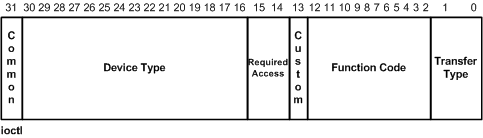

# Hello & Preface

This post has the goal to explore finding arbitrary memory vulnerabilities on NT based kernels (Windows), or in simple terms, finding ways to get into the kernel.

## The target

In this blog post we're just going to cover how to attack kernel drivers via I/O control codes (IOCTL) calls.
IOCTLs are the REST-API of the driver world, we make a request to the driver via these IOCTL's
we get back a response from the driver, or the driver performs some task based on the input we've provided it.

## What is an IOCTL

An IOCTL allows for usermode applications (usually running as Administrator in Windows terms) to communicate with drivers, via some shared protocol defined at the software level that both the application and driver share.

An IOCTL code is structured in the following way [credit to microsoft for the picture](https://learn.microsoft.com/en-us/windows-hardware/drivers/kernel/defining-i-o-control-codes):


The `transfer type` bits are important because it specifies how the IOCTL endpoint takes the payload (`METHOD_BUFFERED`, `METHOD_IN_DIRECT` and `METHOD_OUT_DIRECT`).
All of which we'll cover later on when we get to the decompilation section of this post.

## How we're attacking IOCTLs

When researching this topic prior, I stumbled across [this article](https://blog.back.engineering/01/11/2020/) by "back.engineering",
which goes into depth about how you can attack drivers using dangerous Windows API functions incorrectly.

### [MmMapIoSpace](https://learn.microsoft.com/en-us/windows-hardware/drivers/ddi/wdm/nf-wdm-mmmapiospace)

```cpp
PVOID MmMapIoSpace(
  PHYSICAL_ADDRESS    PhysicalAddress,
  SIZE_T              NumberOfBytes,
  MEMORY_CACHING_TYPE CacheType
);
```

This function looks abit daunting, let's break it down.
`MmMapIoSpace` takes a physical address an amount of bytes and maps it to a virtual address we can access and write to from our application.

#### What is a physical address?
Simply put these physical addresses represent and address on the physical RAM/Memory module, to go into how these work would take far far too long. 
When you write code, and you allocate memory (via malloc or the stack or something), normally, you'll plop your object/buffer in this space 0x000'00000000 - 0x7FFF'FFFFFFFF. 
This is just to your application, you have *potentially* [128 Terabytes of uninterupted](https://learn.microsoft.com/en-us/windows-hardware/drivers/gettingstarted/virtual-address-spaces), contiguous memory.
However we can't do this for every application running on a computer, so we have to do some magic as the processor and place a bit of your allocated memory in other parts of the RAM/Memory, as there might not always be *for example* 10,000 KB free contiguously. So we just keep a note (or page) somewhere of what parts of Physical Memory you have allocated to which Virtual Address.
This process is called Paging, and something we'll go into in another seperate blog post. 
But for right now you sort of only need to know there are two types of addresses, Virtual and Physical.

Let's roleplay a silly/lazy kernel developer writing some vulnerable code, perhaps we're writing a fan driver
and we have some hardware (the fan) reading information from a specific physical address in memory from our usermode application.
Of course, we're not allowed to write to physical memory addresses from user-mode, so we have to get our driver to that bit.
But again, we're lazy, and we have a bunch of different hardware reading from different addresses.
It's easier for us to update our application than it is to update our driver, so we'll just **trust** the value from the application.

```c
/**
  For the sake of brevity, assume all of these parameters are user specified somewhere
  up the call stack and aren't modified from the IOCTL request.
**/
int ioctl_handler(
  PHYSICAL_ADDRESS  physicalAddress,
  void*             userSpaceBuffer,
  SIZE_T            userSpaceBufferSize
)
{
  // ...
  void* thePhysicalBuffer = MmMapIoSpace(physicalAddress, userSpaceBufferSize, MmNonCached)
  memcpy(thePhysicalBuffer, userSpaceBuffer, userSpaceBufferSize); // copy memory into mapped buffer
}
```
Hmm, Well our boss is now happy, we've pushed it live, it works and we've future proofed it!
Now let's come back to reality and work out what's gone wrong here. We've just allowed any application with Administrator to write memory **ANYWHERE** in the computer, kernel etc. 
Why? because we're trusting the IOCTL call, we've not checked any of the parameters going into this function.

So now we know what to look for when investigating calls to this function.
### [ZwMapViewOfSection](https://learn.microsoft.com/en-us/windows-hardware/drivers/ddi/wdm/nf-wdm-zwmapviewofsection)

### [MmCopyMemory](https://learn.microsoft.com/en-us/windows-hardware/drivers/ddi/ntddk/nf-ntddk-mmcopymemory)

I won't go into as-much detail here, as this function is mainly for reading memory from an address and isn't really a "jackpot".
I'm sure someone smarter than I could turn a Read only vulnerability to Read and Write (I recall this being the case somewhere) via some spooky black magic.
```cpp
NTSTATUS MmCopyMemory(
  PVOID           TargetAddress,
  MM_COPY_ADDRESS SourceAddress,
  SIZE_T          NumberOfBytes,
  ULONG           Flags,
  PSIZE_T         NumberOfBytesTransferred
);
```
This function similarly, copies memory from a "Source Address", this is either Physical Or Virtual, to a Target Address, this target address is a virtual address in kernel land.


# The hunt is on
Cool, preface done, we've got the basic information to get ready to start chipping away at our first driver.

So our plan is to:

1. Scan a driver selection of drivers, checking for the vulnerable methods listed above.
2. Open up the driver in Ghidra and determine how it's used and check if we can control the input to it
3. If we can, write up a Proof of Concept
4. Profit?

## The Tools:

To explore potentially vulnerable drivers, we must acquire some basic tools. The tools I've listed here are just
ones I personally use.

### Ghidra:

- Author: NSA (yes that NSA)
- Source: https://github.com/NationalSecurityAgency/ghidra
- License: Apache 2.0
- Note: Used to decompile the drivers we're investigating.

### Suspector:

- Author: Harry Kerr (that's me!)
- Source: https://github.com/NoSharp/suspector
- License: MIT
- Note: Used to identify potentially vulnerable drivers from a large list of drivers.

## Target Practice
Someone has already curated a list of vulnerable drivers for us to dig into.
https://github.com/namazso/physmem_drivers contains a list of various drivers we can start with.
From this list I've selected one at random, and will run through the step-by-step process of locating an vulnerability.
For future refence this sample will be called "Sample1.sys"

### Step 1, Decompilation
For this step, it's straight forward, we chuck it in ghidra and see what happens.
I'm going to skip acquiring the correct GDT files for ntddk and will just drop a link in the references.

So our entry point in ghidra is as follows:
```cpp
void entry(longlong param_1)
{
  FUN_00016104();
  FUN_00016008(param_1);
  return;
}
```

Here we can see `param_1` the Pointer to our Driver Object (PDRIVER_OBJECT), this object allows us to do things like register
DeviceIOControl methods and listen to IOCTL's (referring back to our REST Example, this is the equivalent of a server).
To make reversing this easier to understand, let's rename `FUN_00016008` to `driver_init`.

So, let's dig into, `driver_init`:
*note: parts of this function has been removed for brevity*
```cpp
ulonglong driver_init(PDRIVER_OBJECT param_1)
{
  // ...
  RtlInitUnicodeString(local_28,'\\Device\\Sample1');
  RtlInitUnicodeString(local_18,'\\DosDevice\\Sample1');

  // Setup and get our driver ready to use the IRP API's (this allows for us to listen to IOCTLs)
  uVar4 = IoCreateDevice(param_1,0x40,local_28,0x22,0,0,local_res18); 
  // Is our call successful?
  if (-1 < (int)uVar4) {
    // We will allow the user-mode application to use either the DosDevice String OR Device String
    // When constructing a pipe later on.
    uVar3 = IoCreateSymbolicLink(local_18);
    uVar4 = (ulonglong)uVar3;
    if ((int)uVar3 < 0) {
      IoDeleteDevice(local_res18[0]);
    }
    else {
      // ...
      *(code **)(param_1 + 0xe0) = FUN_000110a8; // IMPORTANT (1)
      *(code **)(param_1 + 0x68) = FUN_00011030;
      // ...
    }
  }
  return uVar4;
}
```

Based on the [structure of the DRIVER_OBJECT](https://www.vergiliusproject.com/kernels/x64/Windows%2011/23H2%20(2023%20Update)/_DRIVER_OBJECT)
we can see that any offset after `0x70` is considered to be part of the "MajorFunction" table, which is what the kernel calls in the driver
to respond to certain IOCTL requests.

Looking at the line marked important and ending with `1`, we can see an offset `0xe0` being used. 
With some basic maths (`0xe0-0x70=0x70`) we can see that this is `0x70` bytes away from the start of the MajorFunctions array.
Each address in the MajorFunctions table is `8` bytes long, so again more maths and we can work out what index this actually is (`0x70 / 8 = 0xE`).

Using the table (extracted from wdm.h)
```c
#define IRP_MJ_CREATE                   0x00
#define IRP_MJ_CREATE_NAMED_PIPE        0x01
#define IRP_MJ_CLOSE                    0x02
#define IRP_MJ_READ                     0x03
#define IRP_MJ_WRITE                    0x04
#define IRP_MJ_QUERY_INFORMATION        0x05
#define IRP_MJ_SET_INFORMATION          0x06
#define IRP_MJ_QUERY_EA                 0x07
#define IRP_MJ_SET_EA                   0x08
#define IRP_MJ_FLUSH_BUFFERS            0x09
#define IRP_MJ_QUERY_VOLUME_INFORMATION 0x0a
#define IRP_MJ_SET_VOLUME_INFORMATION   0x0b
#define IRP_MJ_DIRECTORY_CONTROL        0x0c
#define IRP_MJ_FILE_SYSTEM_CONTROL      0x0d
#define IRP_MJ_DEVICE_CONTROL           0x0e
#define IRP_MJ_INTERNAL_DEVICE_CONTROL  0x0f
#define IRP_MJ_SHUTDOWN                 0x10
#define IRP_MJ_LOCK_CONTROL             0x11
#define IRP_MJ_CLEANUP                  0x12
#define IRP_MJ_CREATE_MAILSLOT          0x13
#define IRP_MJ_QUERY_SECURITY           0x14
#define IRP_MJ_SET_SECURITY             0x15
#define IRP_MJ_POWER                    0x16
#define IRP_MJ_SYSTEM_CONTROL           0x17
#define IRP_MJ_DEVICE_CHANGE            0x18
#define IRP_MJ_QUERY_QUOTA              0x19
#define IRP_MJ_SET_QUOTA                0x1a
#define IRP_MJ_PNP                      0x1b
#define IRP_MJ_PNP_POWER                IRP_MJ_PNP      // Obsolete....
#define IRP_MJ_MAXIMUM_FUNCTION         0x1b
```

We can see that `0x0e` or `0xe` corresponds to `IRP_MJ_DEVICE_CONTROL` which happens to be the offset 
in the array that allows us to handle IOCTL calls.

### IRP_MJ_DEVICE_CONTROL MajorFunction callback

So we now know that `FUN_00011030` references a [DriverDispatch Callback function](https://learn.microsoft.com/en-us/windows-hardware/drivers/ddi/wdm/nc-wdm-driver_dispatch)

Below defines a DriverDispatch callback and the parameters defined within.
For us the most important parameter is the _IRP or IRP parameter.
This contains what the user sends to the driver.
```cpp
NTSTATUS DriverDispatch(
  [in, out] _DEVICE_OBJECT *DeviceObject,
  [in, out] _IRP *Irp
)
```

The callback function is massive and will definitely not fit into this blog post. So let's trim it down and clean it up
```cpp
int FUN_000110a8(longlong param_1, _IRP* irp)
{
  puVar3 = *(ulonglong **)(irp + 0x18);
  iVar9 = 0;
  *(undefined4 *)(irp + 0x30) = 0;
  *(undefined8 *)(irp + 0x38) = 0;
  if (**(char **)(irp + 0xb8) != '\x0e') goto LAB_0001197a; // IMPORTANT (1)
  uVar17 = *(uint *)(*(char **)(irp + 0xb8) + 0x18);
  if (uVar17 < 0x222859) {
    if (uVar17 == 0x222858) {
      uVar11 = FUN_00011b1c((short *)puVar3);
      *(int *)(param_2 + 0x30) = (int)uVar11;
      if (-1 < (int)uVar11) {
        *(undefined8 *)(param_2 + 0x38) = 0x204;
      }
      goto LAB_0001197a;
    }
    if (uVar17 < 0x222831) {
      if (uVar17 != 0x222830) {
        if (uVar17 != 0x222808) {
          if (uVar17 == 0x22280c) {
            puVar10 = (undefined4 *)MmMapIoSpace(*puVar3,*(undefined4 *)(puVar3 + 1),0);
            if (puVar10 == (undefined4 *)0x0) {
              iVar9 = -0x3fffffff;
            }
            // ....
          }
        }
      }
    }
  }
}
```
Alright so let's do the same offset tracking again, 
note if in you're in ghidra and have the correct GDT file you don't need to do this and can specify the type instead.
`(**(char **)(irp + 0xb8) != '\x0e')`\
What's going on here? well, offset is 0xb8 and according to the [IRP Structure](https://www.vergiliusproject.com/kernels/x64/Windows%2011/23H2%20(2023%20Update)/_IRP)
This is either a PacketType OR a [_IO_STACK_LOCATION](https://www.vergiliusproject.com/kernels/x64/Windows%2011/23H2%20(2023%20Update)/_IO_STACK_LOCATION) pointer.
I'm going to assume based on the context clues of it being derefernced, this is a _IO_STACK_LOCATION pointer.
So, let's re-write this as `(**(char **)(irp + 0xb8 + 0x00) != '\x0e')`, the `0x00` there makes it much easier to understand.
The first byte or `0x00` offset is defined as the MajorFunction, so all this line is doing is checking if the IRP is intended for a `IRP_MJ_DEVICE_CONTROL`.


Great now we just need to work out what's going on with `uVar17`, it appears to be the IOCTL code based on it's usage, however let's make sure.
`uVar17 = *(uint *)(*(char **)(irp + 0xb8) + 0x18)`, we know that the _IO_STACK_LOCATION is defined at `0xb8`. We know the offset we're looking for is `0x18`.
According to the linked documentation the structure is a large union of many different types, using common sense we can assume it's refferring to this union entry:
```cpp
struct
{
  ULONG OutputBufferLength;                                       //0x8
  ULONG InputBufferLength;                                        //0x10
  ULONG IoControlCode;                                            //0x18
  VOID* Type3InputBuffer;                                         //0x20
} DeviceIoControl;      
```
And bingo, `0x18` is our IoControlCode.
Cool, we've now located our IOCTL code and where it's used.
```cpp
    if (uVar17 == 0x222894) {
      iVar9 = reading_func((longlong *)puVar3);
      *(int *)(irp + 0x30) = iVar9;
      if (-1 < iVar9) {
        *(undefined8 *)(irp + 0x38) = 0x30;
      }
      goto LAB_0001197a;
    }
```
Again this function is massive, there's many many different IOCTLs, the one above is just the most interesting.
We see `reading_func` is called here (obviously this isn't the original function name) with a single parameter a longlong * or a void*.
`puVar3` is defined as `  puVar3 = *(ulonglong **)(irp + 0x18);` or `puVar3 = irp->SystemBuffer` [according to the IRP structure](https://www.vergiliusproject.com/kernels/x64/Windows%2011/23H2%20(2023%20Update)/_IRP).
The `reading_func` method is long, so I've trimmed out unnessecary bits, cleaned it up and attempted to document it.
```cpp
int reading_func(longlong *param_1)
{

  iVar3 = -0x3fffffff;
  _Src = (ulonglong *)ExAllocatePoolWithTag(0,0x2000,0x6d656d66); // malloc 8,196 bytes or ~8kb
  FUN_000126f0(_Src,0,0x1000); // appears to set first 4kb of memorry to 0.

  while (*(int *)(param_1 + 1) != 0) { // param_1 + 0x08
    uVar6 = *(uint *)(param_1 + 1); // so param_1 + 0x08

    if (uVar6 < 0x1001) {
      *(undefined4 *)(param_1 + 1) = 0;
    }
    else {
      iVar1 = uVar6 - 0x1000;
      uVar6 = 0x1000;
      *(int *)(param_1 + 1) = iVar1;
    }

    _Src_00 = (void *)MmMapIoSpace(*param_1,0x1000,0); // param_1[0x0] - Address?
    if (_Src_00 != (void *)0x0) {
      memcpy(_Src + 0x200,_Src,0x1000); // Copy the first 1kb to SRC + 0x200, seems odd
      memcpy(_Src,_Src_00,0x1000); // copy first 4kb of mapped memory into our _SRC Buffer
      uVar5 = 0;
      if (uVar6 != 0) {
        do {
          uVar4 = *(uint *)(param_1 + 4); // param_1->0x20
          matching_amount = RtlCompareMemory(uVar5 + (longlong)_Src,param_1[3],uVar4); // param_1->0x18
          if (matching_amount == uVar4) { // do all bytes match?
            if (*(int *)(param_1 + 2) == 0) {
              iVar3 = 0;
              param_1[5] = uVar5 + *param_1;
              break;
            }
            *(int *)(param_1 + 2) = *(int *)(param_1 + 2) + -1;
          }
          uVar4 = (int)uVar5 + *(int *)((longlong)param_1 + 0xc);
          uVar5 = (ulonglong)uVar4;
        } while (uVar4 < uVar6);
      }
      MmUnmapIoSpace(_Src_00,0x1000);
    }
    if (iVar3 == 0) break;
    if (*(char *)((longlong)param_1 + 0x24) == '\0') {
      *param_1 = *param_1 + 0x1000;
    }
    else {
      *param_1 = *param_1 + -0x1000;
    }
  }
  ExFreePoolWithTag(_Src,0);
  return iVar3;
}

```
So, things to note,
## References & Credits

- my lovely girlfriend [emily](https://emilymedhurst.gay/) for proof-reading this
- https://www.vergiliusproject.com
- https://learn.microsoft.com/en-us/windows-hardware/drivers/kernel/defining-i-o-control-codes
